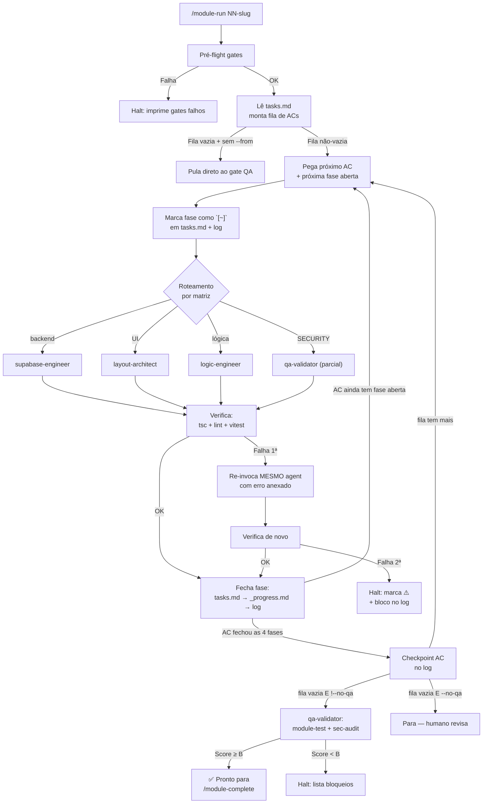

# /module-run <NN-slug>

Orquestra a execução **completa** de um módulo cujo SDD já está pronto (`spec.md` + `tasks.md` + `security.md`). Lê a fila de critérios de aceite (ACs) pendentes em `tasks.md`, despacha cada fase (RED/GREEN/REFACTOR/SECURITY) ao subagent dono, valida o entregável tecnicamente, mantém estado em disco sincronizado em tempo real, aplica auto-retry 1x em falhas técnicas e dispara o gate final de QA.

**Para antes de `/module-complete`** — esse comando final continua sendo gate humano.

---

## Uso

```
/module-run <NN-slug>                   # roda do início (ou retoma do que estava `[~]`)
/module-run <NN-slug> --dry-run         # mostra a fila e o roteamento, NÃO executa nada
/module-run <NN-slug> --from AC-08      # reabre AC-08 e em diante (sobrescreve [x] para [ ])
/module-run <NN-slug> --no-qa           # executa todos ACs e PARA antes do gate final de QA
```

**Exemplos**:
```
/module-run 01-auth-and-session
/module-run 01-auth-and-session --dry-run
/module-run 01-auth-and-session --from AC-08
/module-run 04-fixed-bills --no-qa
```

---

## Pré-requisitos (todos bloqueantes)

| # | Pré-requisito | Como verificar |
|---|---------------|----------------|
| 1 | Pasta `specs/modules/<NN-slug>/` existe com `spec.md` + `tasks.md` + `security.md` | listar arquivos |
| 2 | `_progress.md` mostra Spec `✅ Pronto` para o módulo | grep |
| 3 | Status do módulo é `🔄 Em Progresso` ou `⏳ Pendente` (não `✅ Concluído`; não `⚠️ Bloqueado` sem `--from`) | grep |
| 4 | Branch ativa = `feat/<NN-slug>` | `git rev-parse --abbrev-ref HEAD` |
| 5 | Working tree limpa | `git status --porcelain` vazio |
| 6 | `pnpm tsc --noEmit` passa limpo (baseline) | comando direto |
| 7 | `pnpm lint` passa limpo (baseline) | comando direto |

Se algum falhar: o coordenador imprime tabela `| Pré-req | Status | Como destravar |` e encerra **sem modificar nada**.

---

## Pipeline (executado pelo `module-orchestrator`)



Detalhes do algoritmo, matriz de roteamento, política de retry e formato dos artefatos de log: ver [`.cursor/agents/module-orchestrator.md`](../agents/module-orchestrator.md).

---

## Flags

### `--dry-run`

Não executa nada. Apenas:
1. Lê `tasks.md`.
2. Monta a fila de ACs pendentes.
3. Aplica matriz de roteamento e imprime, por fase, qual subagent seria invocado.
4. Imprime resumo: total de ACs na fila, total de fases, distribuição por subagent.

**Útil para**: validar que o roteamento está correto antes de gastar tempo de execução.

### `--from AC-XX`

Reabre o AC informado e todos os subsequentes:
- Sobrescreve `[x]` para `[ ]` nesses ACs.
- Atualiza tabela-resumo e cabeçalho.
- Anexa entrada no `orchestration-log.md`: `## Sessão #N — RESUME a partir de AC-XX (forçado por humano)`.

**Útil para**:
- Retomar após halt corrigido manualmente.
- Refazer ACs após mudança de spec.
- Repetir uma fase específica para validar.

### `--no-qa`

Executa todos ACs até a fila esvaziar, mas **não** invoca o gate final de QA. Para antes de rodar `/module-test` + `/sec-audit`.

**Útil para**:
- Quando você quer revisar manualmente o que foi entregue antes do QA.
- Quando o ambiente de QA (E2E, DB) não está disponível na máquina atual.
- Quando você vai rodar `/module-test` e `/sec-audit` separadamente.

---

## Saída esperada (sucesso completo)

```
## Module Orchestrator — Execução

**Módulo**: 01-auth-and-session
**Branch**: feat/01-auth-and-session
**Sessão**: #1 (iniciada em 2026-04-20 14:32)
**Duração total**: 1h 48m

### Resumo
- ACs processados: 10 (AC-01, AC-02, AC-04, AC-07, AC-08, AC-09, AC-10, AC-11, AC-12, AC-14)
- ACs já completos (skip): 4 (AC-03, AC-05, AC-06, AC-13)
- ACs ainda pendentes: 0
- Subagents invocados: logic-engineer (24x), layout-architect (8x), qa-validator (11x)
- Auto-retries usados: 3 (todos resolvidos)
- Halts: 0

### Trilha desta sessão
| AC | RED | GREEN | REFACTOR | SECURITY | Status final |
|----|-----|-------|----------|----------|--------------|
| 08 | ✅  | ✅    | ✅       | ✅       | ✅ Concluído |
| 10 | ✅  | ✅    | ✅       | ✅       | ✅ Concluído |
| 09 | ✅  | ✅    | ✅       | ✅       | ✅ Concluído |
| 01 | ✅  | ✅    | ✅       | ✅       | ✅ Concluído |
| 02 | ✅  | ✅    | ✅       | ✅       | ✅ Concluído |
| 14 | ✅  | ✅    | ✅       | ✅       | ✅ Concluído |
| 11 | ✅  | ✅    | ✅       | ✅       | ✅ Concluído |
| 12 | ✅  | ✅    | ✅       | ✅       | ✅ Concluído |
| 07 | ✅  | ✅    | ✅       | ✅       | ✅ Concluído |
| 04 | ✅  | ✅    | ✅       | ✅       | ✅ Concluído |

### Snapshot atual
- `tasks.md`: Concluídos 14/14, Em andamento 0, Pendentes 0
- `_progress.md`: Status `🔄 Em Progresso`, Cobertura 87%, Score A
- `quality-report.md`: gerado em 2026-04-20 16:18

### Gate QA
✅ Scorecard A — 14 Leis ✅, 1 ⚠️ documentada, 0 ❌
✅ Cobertura 87% (alvo ≥ 80%)
✅ A11y: 0 violations critical/serious
✅ TS strict + Lint + Audit: ✅

### Próximo passo
🚦 Módulo pronto para fechamento — humano precisa rodar:
   /module-complete 01-auth-and-session

### Logs
- specs/modules/01-auth-and-session/orchestration-log.md (88 entradas nesta sessão)
- specs/modules/01-auth-and-session/tasks.md (14 ACs ✅)
- specs/_progress.md (linha 01 atualizada: Cobertura 87%, Score A)
```

---

## Saída esperada (halt no meio)

```
## Module Orchestrator — Execução INTERROMPIDA

**Módulo**: 01-auth-and-session
**Sessão**: #1
**Duração até halt**: 42m 18s

### ACs fechados nesta sessão
- AC-08 ✅, AC-10 ✅, AC-09 ✅

### ⛔ HALT em AC-01 / GREEN — logic-engineer

**Tentativas**: 2/2 (1 inicial + 1 retry)

**Erro final**:
\`\`\`
TS2322: Type 'undefined' is not assignable to type 'User'
  src/features/auth/hooks/useRegister.ts:42:5

  40|       options: {
  41|         data: {
  42|           full_name: input.fullName,
\`\`\`

**Estado atual em disco**:
- `tasks.md`: AC-01 / GREEN marcado ⚠️, Status `⛔ Bloqueado`
- `_progress.md`: Status `⚠️ Bloqueado` — ver orchestration-log.md
- `orchestration-log.md`: bloco completo do halt no fim do arquivo

**Como destravar**:
1. Investigar tipagem em `useRegister.ts` (provavelmente `data` precisa ser tipado como `Partial<User>` ou similar)
2. Aplicar fix manualmente (ou via /Cursor com escopo no arquivo)
3. Verificar com `pnpm tsc --noEmit` localmente
4. Retomar com: `/module-run 01-auth-and-session --from AC-01`
```

---

## Diferença vs comandos existentes

| Comando | O que faz | Quando usar |
|---------|-----------|-------------|
| `/spec-draft "tema"` | Gera spec.md + tasks.md + security.md via `spec-architect` | Início do módulo (SDD) |
| **`/module-run NN-slug`** | **Orquestra todos subagents para executar TODOS ACs do módulo + dispara QA final** | **Após spec pronto, quando quer reduzir hand-off manual** |
| `/module-test [NN-slug]` | Roda baterias de teste do módulo, gera quality-report parcial | Manualmente após implementar ACs (ou chamado pelo `/module-run`) |
| `/sec-audit [NN-slug]` | Audita as 15 Leis, gera Security Scorecard | Manualmente antes do complete (ou chamado pelo `/module-run`) |
| `/module-complete NN-slug` | Valida gates finais, atualiza `_progress.md` para Concluído, gera commit | **Após `/module-run` instruir explicitamente** — sempre humano |

`module-run` é o **wrapper** que invoca `module-test` + `sec-audit` (via `qa-validator`) ao final, mas **nunca** invoca `module-complete` (gate humano não-negociável).

---

## Princípios

1. **Não inventa nada** — fonte de verdade é `tasks.md` + `security.md`. Se ambíguo, pergunta.
2. **Estado em disco = realidade** — interrupção a qualquer momento, retoma sem perda.
3. **Auto-retry é serviço** — 1x por fase com erro completo no prompt; 2ª falha = humano.
4. **Não escreve código de produção** — só despacha e valida; subagents donos é que implementam.
5. **`/module-complete` sempre humano** — coordenador para na porta, nunca atravessa.

---

## Próximo passo

- ✅ Sucesso completo → `/module-complete <NN-slug>`
- ⛔ Halt → corrigir manualmente + `/module-run <NN-slug> --from AC-XX`
- 🚦 Pausou em `--no-qa` → revisar manualmente + `/module-test` + `/sec-audit` + `/module-complete`
