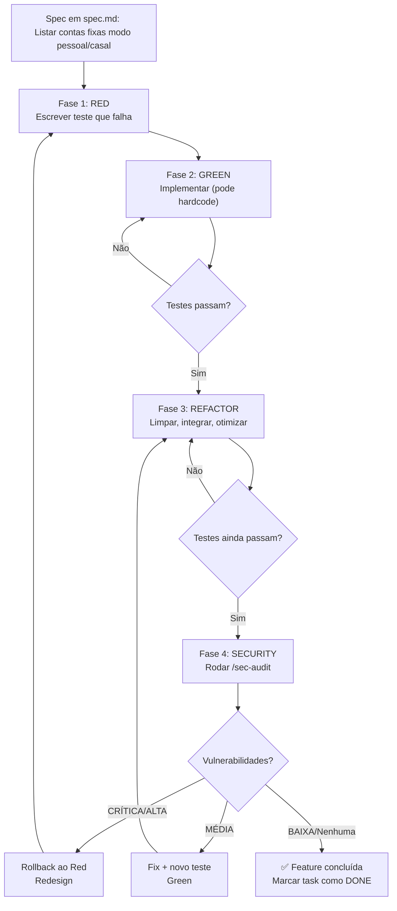

# 🔄 TDD Flow — Red-Green-Refactor-Security

Ciclo obrigatório para toda feature. Nenhuma feature é considerada "completa" até passar pelas 4 fases.

## Fase 1: Red — Teste Falhando

**Objetivo**: Especificar o comportamento esperado em código de teste.

1. Ler o critério de aceite (do `spec.md`).
2. Traduzir para teste que **falha**.
   - Padrão: Vitest browser-mode ou Playwright (depende do escopo).
   - Padrão de nome: `test("SPEC-N: deve fazer X quando Y")`.
   - Incluir AAA: Arrange, Act, Assert.
3. Verificar que o teste realmente falha (`pnpm test:unit -- --reporter=verbose`).
4. **Nunca prosseguir sem confirmar Red**.

**Exemplo** (módulo 04-fixed-bills):

```typescript
test("SPEC-1: deve listar contas fixas do household em modo casal", async () => {
  const { render } = setup({ viewMode: "couple", householdId: "hh-1" })
  render(<FixedBillsList />)
  
  await waitFor(() => {
    expect(screen.getByText("Internet")).toBeInTheDocument()
    expect(screen.getByText("Aluguel")).toBeInTheDocument()
  })
})
// ❌ Red: "FixedBillsList não renderiza nada"
```

---

## Fase 2: Green — Implementação Mínima

**Objetivo**: Passar no teste com a implementação mais simples possível.

1. Ler o teste da Fase 1.
2. Implementar apenas o suficiente para passar.
   - **Proibido**: refatoração, otimização, features extras.
   - **Permitido**: hardcode se necessário (será refatorado em breve).
3. Rodar `pnpm test:unit` — o teste deve passar.
4. **Nunca prosseguir com testes falhando**.

**Exemplo** (continuação):

```typescript
function FixedBillsList() {
  const [bills, setBills] = useState([
    { id: "1", name: "Internet", value: 150 },
    { id: "2", name: "Aluguel", value: 2000 },
  ])
  
  return (
    <ul>
      {bills.map(bill => <li key={bill.id}>{bill.name}</li>)}
    </ul>
  )
}
// ✅ Green: teste passa, mas dados estão hardcoded
```

---

## Fase 3: Refactor — Limpeza

**Objetivo**: Melhorar qualidade sem quebrar testes.

1. Testes devem **sempre passar** durante refatoração.
2. Focos típicos:
   - Remover hardcode: integrar com React Query.
   - Extrair componentes: `<BillRow>`, `<BillActions>`, etc.
   - Aplicar padrões: Zustand para estado compartilhado, hooks customizados.
   - Otimização: memoization, lazy loading, query keys.
3. Seguir regras de projeto: RORO, named exports, `cn()`, Tailwind.
4. Rodar `pnpm lint` — sem erros/warnings.
5. Rodar `pnpm test:unit` — cobertura ≥ 80%.

**Exemplo** (continuação):

```typescript
import { useQuery } from "@tanstack/react-query"
import { fetchFixedBills } from "@/features/bills/api"

function FixedBillsList() {
  const { householdId } = useAuthStore()
  const { data: bills } = useQuery({
    queryKey: ["bills", householdId, "fixed"],
    queryFn: () => fetchFixedBills(householdId),
  })
  
  if (!bills) return <Skeleton />
  
  return (
    <ul>
      {bills.map(bill => <BillRow key={bill.id} bill={bill} />)}
    </ul>
  )
}
// ✅ Refactor: dados dinâmicos, componentes extraídos, testes ainda passam
```

---

## Fase 4: Security — Auditoria Obrigatória

**Objetivo**: Verificar que a implementação obedece às 15 Leis de segurança.

1. Rodar `/sec-audit` com escopo no arquivo/módulo da feature.
2. Verificar output em 3 fases:
   - **Red Team** (vulnerabilidades): CRÍTICA/ALTA/MÉDIA/BAIXA.
   - **Blue Team** (código corrigido): mudanças aplicadas.
   - **Security TDD** (testes de segurança): cobertura de vuln.
3. Se vulnerabilidades encontradas:
   - **CRÍTICA/ALTA**: rollback, redesign, voltar ao Red.
   - **MÉDIA**: fix + novo teste de segurança, depois Green.
   - **BAIXA**: fix, update de `security.md`, documentar.
4. Scorecard final: nota A–F. Mínimo aceito: **B** (sem críticas).

**Checklist de `/sec-audit`:**

- [ ] Lei 5 (IDOR): Usuário A consegue ler/editar/deletar de B?
- [ ] Lei 6 (Broken Access Control): Usuário comum acessa admin?
- [ ] Lei 7 (RLS): Tabelas têm policies? Testadas?
- [ ] Lei 9 (Data Exposure): Retornando campos sensíveis?
- [ ] Lei 11 (Secrets): Hardcoded no código ou logs?

---

## Fluxo Completo: Exemplo Módulo 04-Fixed-Bills



---

## Boas Práticas de Teste

### Nome Descritivo

✅ Bom:
```typescript
test("SPEC-4: deve marcar conta fixa como paga com a data real quando usuario clica em 'Pagar'", async () => { ... })
```

❌ Ruim:
```typescript
test("marks bill as paid", async () => { ... })
```

### Dados Mínimos

✅ Bom:
```typescript
const bill = {
  id: "bill-1",
  name: "Internet",
  value: 150,
  dueDay: 5,
  status: "active",
  householdId: "hh-1",
  authorId: "user-1",
}
```

❌ Ruim:
```typescript
const bill = completeFixedBill() // função que popula 50 campos
```

### Setup Reutilizável

✅ Bom:
```typescript
function setupTest(overrides = {}) {
  const householdId = "hh-1"
  const user = { id: "user-1", email: "test@test.com", ...overrides.user }
  return { householdId, user }
}
```

❌ Ruim:
```typescript
// Setup inline em cada teste, hardcoded, sem reuso
```

### Assertions Claras

✅ Bom:
```typescript
expect(screen.getByRole("button", { name: /pagar/i })).not.toBeDisabled()
```

❌ Ruim:
```typescript
expect(button.hasAttribute("disabled")).toBe(false)
```

---

## Quando Pular Fases?

### RED → GREEN (sem testes isolados)
- Permitido para protótipo rápido não-crítico.
- Nunca para código de produção ou dados financeiros.
- Sempre voltar e escrever testes depois.

### GREEN → REFACTOR (sem testes verdes)
- Proibido. Refactor só com testes passing.

### REFACTOR → SECURITY (pulando /sec-audit)
- Proibido. Security é gate obrigatório.

---

## Frequência

- **RED**: 5-15 min (especificar comportamento).
- **GREEN**: 10-30 min (codificar rápido).
- **REFACTOR**: 15-60 min (qualidade).
- **SECURITY**: 20-45 min (auditoria).

Total por feature pequena: ~2-3h. Por feature grande: ~8-12h (pode ser varios dias se crítica encontrada).

---

## Automação opcional: coordenador `/module-run`

Quando o módulo já tem `spec.md` + `tasks.md` + `security.md` prontos e maduros, é possível percorrer todos os ACs sem hand-off manual usando o agente `module-orchestrator` via `/module-run <NN-slug>`.

O ciclo R-G-R-S de cada AC continua sendo executado pelos subagents donos (`supabase-engineer`, `logic-engineer`, `layout-architect`, `qa-validator`) — o coordenador apenas:

1. Lê `tasks.md` e monta a fila de ACs pendentes.
2. Despacha cada fase ao subagent correto (matriz de roteamento por palavras-chave + paths em `Evidence:`).
3. Roda verificação técnica obrigatória (`pnpm tsc + lint + vitest`) após cada entrega.
4. Aplica auto-retry 1x se falhar; halt e pede humano se falhar 2x.
5. Atualiza em cascata `tasks.md` + `_progress.md` + `orchestration-log.md` após **cada fase** (não só ao fim do AC) — assim, interrupção em qualquer ponto deixa o estado em disco fiel à realidade.
6. Ao esvaziar a fila, dispara `qa-validator` para `module-test` + `sec-audit` e instrui o humano a rodar `/module-complete` se Scorecard ≥ B.

**Importante**: o coordenador **nunca inventa** requisitos, **nunca escreve código de produção**, **nunca faz commit** e **nunca roda `/module-complete`**. É apenas orquestração + auditoria.

Documentação: [`.cursor/agents/module-orchestrator.md`](../.cursor/agents/module-orchestrator.md) · [`.cursor/commands/module-run.md`](../.cursor/commands/module-run.md).

